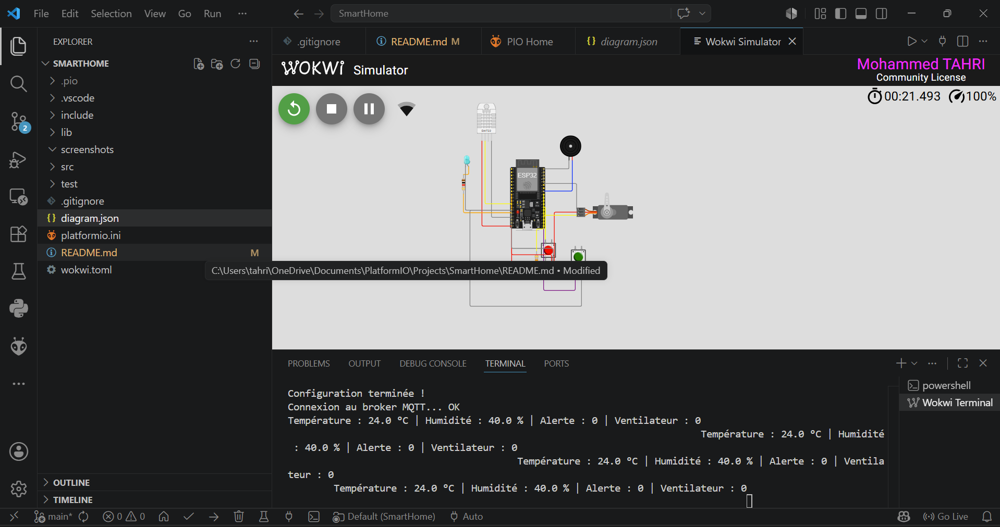
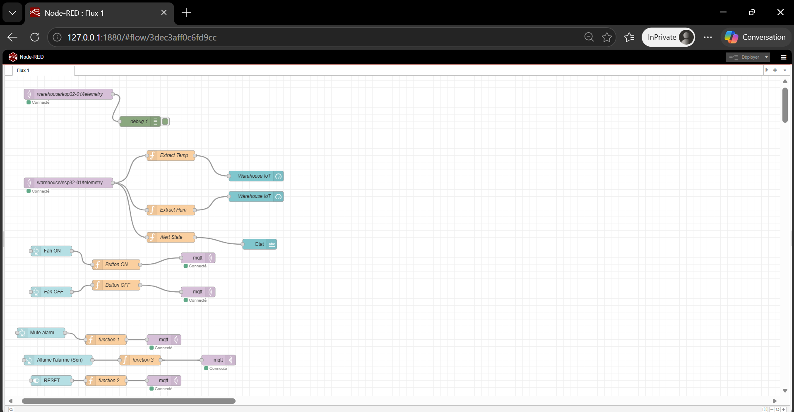
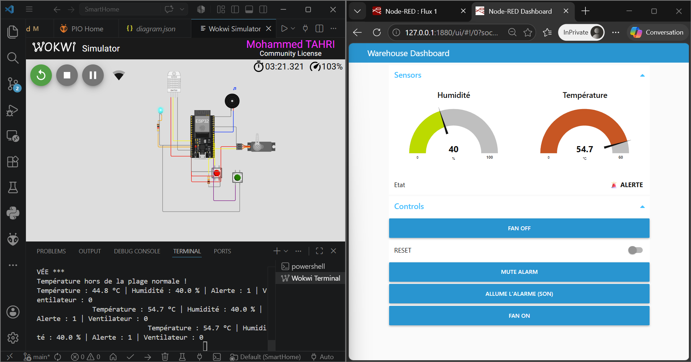

# 🔐 Secure Smart Environment Monitoring and Control using ESP32 and MQTTS


A secure IoT-based environment monitoring and control system developed using **ESP32**, **MQTT/MQTTS**, **Wokwi simulation**, and **Node-RED Dashboard** for real-time monitoring, remote control, and secure communication.

---

# 📌 Project Context

The rapid development of IoT technologies enables the creation of intelligent systems capable of monitoring and controlling environments remotely.

This project proposes a smart environment monitoring and control system capable of:

- Monitoring temperature and humidity in real time
- Detecting abnormal environmental conditions
- Triggering alarms automatically
- Controlling devices remotely
- Displaying data through an interactive dashboard
- Securing communication using MQTT over TLS (MQTTS)

---

# 🎯 Project Objectives

The main objectives of this project are:

✔ Monitor environmental conditions in real time  
✔ Enable remote device control  
✔ Implement MQTT Publish/Subscribe communication  
✔ Visualize data using Node-RED Dashboard  
✔ Introduce secure communication through TLS  

---

# 🏗 System Architecture

```text
VS Code + PlatformIO
        ↓
Firmware Compilation
        ↓
Wokwi Simulation (ESP32)
        ↓
MQTT / MQTTS
        ↓
broker.emqx.io
        ↓
Node-RED
        ↓
Dashboard
```

---

# 🔧 System Components

| Component | Role |
|---|---|
| ESP32 | Main controller |
| DHT22 | Temperature & humidity measurement |
| Servo Motor | Fan simulation |
| LED | Visual alert |
| Buzzer | Sound alarm |
| Push Buttons | Local controls |
| MQTT Broker (EMQX) | Message exchange |
| Node-RED | Data processing |
| Dashboard | User interface |

---

# 📡 MQTT Communication

The project follows the **Publish / Subscribe** architecture.

## MQTT Broker

```text
broker.emqx.io
```

## Topics

| Topic | Direction | Description |
|---|---|---|
| `warehouse/esp32-01/telemetry` | ESP32 → Dashboard | Sensor values |
| `warehouse/esp32-01/commands` | Dashboard → ESP32 | Remote commands |
| `warehouse/esp32-01/events` | ESP32 → Dashboard | Alerts |

---

# 🎛 Dashboard Features

The Node-RED Dashboard provides:

- 🌡 Temperature Monitoring
- 💧 Humidity Monitoring
- 🌀 Fan Control
- 🚨 Alert Detection
- 🔇 Alarm Mute
- 🔄 Alert Reset
- 📊 Real-Time Visualization

Dashboard URL:

```text
http://localhost:1880/ui
```

---

# 🔐 Security Layer

The communication can operate in:

## Standard MQTT

```text
Port 1883
```

## Secure MQTT (MQTTS)

```text
Port 8883
```

Implemented improvements:

- TLS encrypted communication
- Secure transport layer
- Improved confidentiality

Example:

```cpp
WiFiClientSecure espClient;
espClient.setInsecure();
```

> In production environments, certificate validation should replace `setInsecure()`.

---

# ▶️ Execution Instructions

## 1. Clone the repository

```bash
git clone https://github.com/mohammedTahri24/Secure-Smart-Environment-Monitoring-and-Control-using-ESP32-and-MQTTS.git
```

---

## 2. Open the project

Open the project using:

```text
Visual Studio Code + PlatformIO
```

---

## 3. Install dependencies

Libraries are automatically installed from:

```text
platformio.ini
```

---

## 4. Build firmware

```bash
Ctrl + Alt + B
```

---

## 5. Start simulation

Run:

```text
Wokwi → Start Simulation
```

---

## 6. Launch Node-RED

```bash
node-red
```

Open:

```text
http://localhost:1880/ui
```

---

# 📂 Project Structure

```text
SecureSmartHome/
│
├── src/
│   └── main.cpp
│
├── diagram.json
├── platformio.ini
├── wokwi.toml
├── README.md
├── screenshots/
│
└── docs/
```

---

# 📷 Screenshots

## 🧪 Wokwi Simulation



---

## 🔄 Node-RED Flow



---

## 🎛 Dashboard



---

# ▶️ Live Simulation

Wokwi Simulation:

https://wokwi.com/projects/464817024153619457

---

# 🚀 Future Improvements

- Certificate validation
- Cloud deployment
- Historical data storage
- User authentication
- Private MQTT broker

---

# 👨‍💻 Authors

Developed as an academic IoT project.

---

# 📄 License

Educational Use